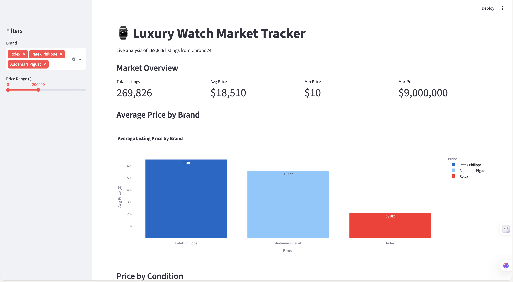

# ⌚ Luxury Watch Market Tracker

A end-to-end data engineering and analytics project that ingests 270,000+ luxury watch listings into PostgreSQL, runs SQL-based market analysis, and visualises insights through an interactive Streamlit dashboard.

Built to mirror real-world alternative asset data workflows — similar to what platforms like Timeless, Chrono24, and WatchCharts operate daily.

---

## 🖥️ Dashboard Preview

> Interactive dashboard with brand filters, price range slider, and live SQL-backed charts.



---

## 📊 Key Insights

| Metric | Value |
|---|---|
| Total listings | 269,826 |
| Avg listing price | ~$19,000 |
| Most listed brand | Rolex (68,798 listings) |
| Highest avg price brand | Richard Mille ($370,190 avg) |
| Most listed model | Rolex Datejust 36 (9,114 listings) |
| Most valuable case material | Platinum ($119,344 avg) |

---

## 🏗️ Project Structure

```
watch-market-tracker/
├── data/
│   └── watches.csv                  # 270k listings from Chrono24
├── notebooks/
│   └── 01_eda.ipynb                 # Exploratory data analysis
├── src/
│   ├── db_setup.py                  # PostgreSQL table creation
│   ├── load_data.py                 # CSV → PostgreSQL pipeline
│   └── queries.py                   # SQL market analysis queries
├── app.py                           # Streamlit dashboard
├── requirements.txt
└── README.md
```

---

## 🚀 Setup

### 1. Clone the repo
```bash
git clone https://github.com/jadendo04/watch-market-tracker.git
cd watch-market-tracker
```

### 2. Create virtual environment
```bash
python -m venv venv
source venv/bin/activate        # Windows: venv\Scripts\activate
pip install -r requirements.txt
```

### 3. Set up PostgreSQL
```bash
createdb watch_tracker
```

### 4. Load the dataset
Download [Luxury Watch Listings](https://www.kaggle.com/datasets/philmorekoung11/luxury-watch-listings) from Kaggle and save as `data/watches.csv`, then:
```bash
python src/load_data.py
```

### 5. Run the dashboard
```bash
streamlit run app.py
```

Open `http://localhost:8501` in your browser.

---

## 🔍 SQL Analysis

The project includes production-style SQL queries covering:

- **Brand performance** — avg, min, max price per brand across 20+ luxury brands
- **Condition premium** — price delta between Unworn, New, Very Good, Good, Fair
- **Model ranking** — most listed models and their average market price
- **Material analysis** — price segmentation by case material (platinum, gold, steel, ceramic)
- **Vintage trends** — avg price and listing volume by year of production (1990–2024)

Example query:
```sql
SELECT brand,
       COUNT(*) as listings,
       ROUND(AVG(price)::numeric, 2) as avg_price,
       ROUND(MAX(price)::numeric, 2) as max_price
FROM watches
WHERE price IS NOT NULL AND brand IS NOT NULL
GROUP BY brand
ORDER BY avg_price DESC
LIMIT 10;
```

---

## 📈 Dashboard Features

- **Brand filter** — multi-select across 20+ luxury brands
- **Price range slider** — dynamic filtering from $0 to $500,000
- **KPI cards** — total listings, avg price, min/max price
- **Bar charts** — avg price by brand and by condition
- **Line chart** — price trend by production year
- **Pie chart** — listing share by case material
- **Raw listings table** — top 100 listings sorted by price

---

## 🛠️ Tech Stack

| Tool | Purpose |
|---|---|
| Python | Data processing and pipeline |
| PostgreSQL | Production database |
| SQLAlchemy | ORM and database connection |
| pandas | Data cleaning and transformation |
| Streamlit | Interactive dashboard |
| Plotly | Charts and visualisations |
| seaborn / matplotlib | EDA visualisations |

---

## 📦 Dataset

[Luxury Watch Listings](https://www.kaggle.com/datasets/philmorekoung11/luxury-watch-listings) — 270,000+ listings scraped from Chrono24.

Brands included: Rolex, Patek Philippe, Audemars Piguet, Richard Mille, Omega, Hublot, IWC, Panerai, Jaeger-LeCoultre, Vacheron Constantin, A. Lange & Söhne, and more.

---

## 🔮 Future Improvements

- Schedule daily data refresh with Apache Airflow
- Add price index tracking over time (similar to HAGI / WatchCharts)
- Build a valuation model to flag underpriced listings
- Deploy dashboard to Streamlit Cloud

---

## 👤 Author

Made by [jadendo04](https://github.com/jadendo04)